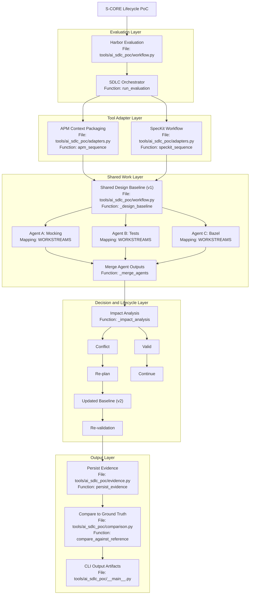
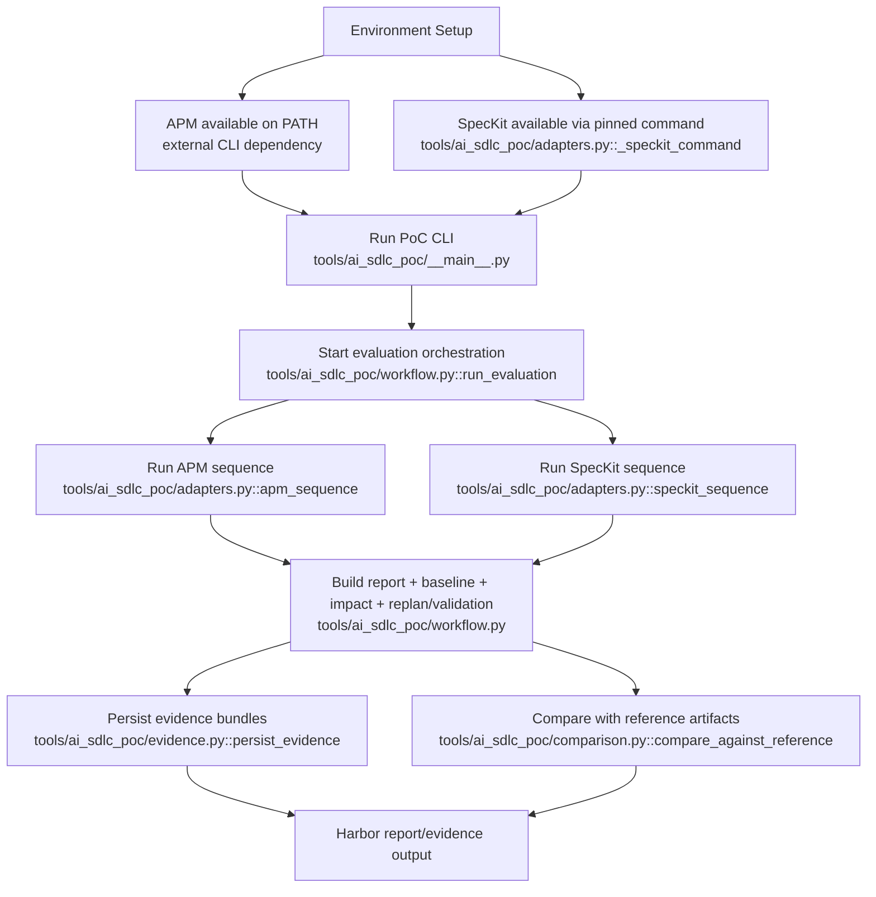

# Harbor AI-SDLC PoC

This package is the first executable slice of the lifecycle PoC. Harbor is the
evaluation and reporting layer; the workflow records the artifacts that the
real SpecKit and Microsoft APM executions must provide.

The offline replay uses the lifecycle task from issue #439, compares against
PR #444 as ground truth, runs sequential and concurrent paths, and deliberately
introduces the `serviceWatchdog()` run-cycle requirement to exercise impact
analysis and re-planning.

## What Was Implemented

The AI-SDLC PoC now includes an executable workflow and evidence pipeline that
can run deterministically offline and can also orchestrate live APM/SpecKit
commands.

Implemented capabilities:

- Deterministic Harbor workflow replay for the benchmark issue:
	"Write unit tests for watchdog in ProcessGroupManager".
	Implemented in: `tools/ai_sdlc_poc/workflow.py` (`run_evaluation`, `ISSUE`).
- Executable CLI entrypoint for running report generation and evidence writing.
	Implemented in: `tools/ai_sdlc_poc/__main__.py` (`main`).
- Shared context package generation with digest tracking so concurrent agents
	can be verified against the same context input.
	Implemented in: `tools/ai_sdlc_poc/workflow.py` (`ContextPackage`, `_context`).
- Design baseline v1 propagation across concurrent workstreams and merge
	artifact generation for Agent A/B/C outputs.
	Implemented in: `tools/ai_sdlc_poc/workflow.py` (`_design_baseline`, `_concurrent`, `_merge_agents`).
- Requirement-change loopback trigger for `serviceWatchdog()` in
	`ProcessGroupManager.run()`.
	Implemented in: `tools/ai_sdlc_poc/workflow.py` (`CHANGED_REQUIREMENT`, `_requirement_change_trigger`).
- Impact analysis over affected artifacts (specification, tasks, Agent B test
	artifacts, and design baseline).
	Implemented in: `tools/ai_sdlc_poc/workflow.py` (`_impact_analysis`).
- Re-plan and validation flow that advances to baseline v2 and records a
	passed validation state for the run-cycle requirement.
	Implemented in: `tools/ai_sdlc_poc/workflow.py` (`run_evaluation`).
- Live adapter scaffolds for SpecKit and APM with two modes:
	- planned mode (records intended commands without execution)
	- execute mode (runs commands and captures outputs)
	Implemented in: `tools/ai_sdlc_poc/adapters.py` (`speckit_sequence`, `apm_sequence`, `_run_or_plan`).
- Report comparison against checked-in reference artifacts to detect drift.
	Implemented in: `tools/ai_sdlc_poc/comparison.py` (`compare_against_reference`).
- DR evidence persistence:
	- DR-009: context, lock/provenance, APM step and audit outputs
	- DR-010: sequential, concurrent, merge, impact, replan, revalidation,
		summary, and comparison outputs
	Implemented in: `tools/ai_sdlc_poc/evidence.py` (`persist_evidence`).
- Requirements traceability metadata in provenance (Sphinx-Needs/ubcode
	fields, linked ID extraction, coverage status).
	Implemented in: `tools/ai_sdlc_poc/evidence.py` (`_build_requirements_tracking`, `_extract_need_ids`).
- Automated tests for workflow behavior and evidence persistence.
	Implemented in: `tools/ai_sdlc_poc/test_workflow.py` and `tools/ai_sdlc_poc/test_evidence.py`.

## Architecture Diagram (with Implementation Files)



Note: the diagram above shows ownership and data flow, not strict time order.

## Chronological Order (Live Execution)



Run from the lifecycle repository root:

```powershell
python -m tools.ai_sdlc_poc --output artifacts/harbor-report.json
python -m tools.ai_sdlc_poc --mode live --output artifacts/harbor-report-live-plan.json
python -m tools.ai_sdlc_poc --mode live --execute-live --output artifacts/harbor-report-live-exec.json
python -m pytest tools/ai_sdlc_poc/test_workflow.py
```

Recommended full validation command:

```powershell
python -m pytest tools/ai_sdlc_poc/test_workflow.py tools/ai_sdlc_poc/test_evidence.py -q
```

The live-tool phase will replace the recorded SpecKit and APM fixture fields
with outputs from pinned `specify` and `apm` commands. The adapter remains
responsible for orchestration evidence, not for reimplementing either tool.

Pinned tool versions are recorded in `tools/ai_sdlc_poc/tooling.lock.json`.

If you need to bootstrap SpecKit locally for this lifecycle harness, use the
version pinned in `tools/ai_sdlc_poc/tooling.lock.json`:

```powershell
.\tools\ai_sdlc_poc\scripts\install_speckit.ps1
```

Evidence bundles are written under `tools/ai_sdlc_poc/evidence/`:

- `dr009/` contains APM-focused context packaging outputs.
- `dr010/` contains orchestration and lifecycle-flow outputs.
- Live step outputs are captured in `dr009/apm-steps.json` and
	`dr010/speckit-steps.json`.
- DR-010 writes both `impact-analysis.json`/`revalidation.json` and the
	compatibility names `impact.json`/`validation.json`.

## Main Code Locations

- `tools/ai_sdlc_poc/workflow.py`: deterministic Harbor workflow, concurrency,
	impact analysis, replan, validation, and live adapter wiring.
- `tools/ai_sdlc_poc/adapters.py`: planned/execute orchestration for SpecKit
	and APM command sequences.
- `tools/ai_sdlc_poc/evidence.py`: DR-009/DR-010 evidence bundle persistence
	and requirements tracking metadata export.
- `tools/ai_sdlc_poc/comparison.py`: normalization and comparison against
	reference Harbor artifacts.
- `tools/ai_sdlc_poc/test_workflow.py`: workflow behavior assertions.
- `tools/ai_sdlc_poc/test_evidence.py`: evidence output structure assertions.
